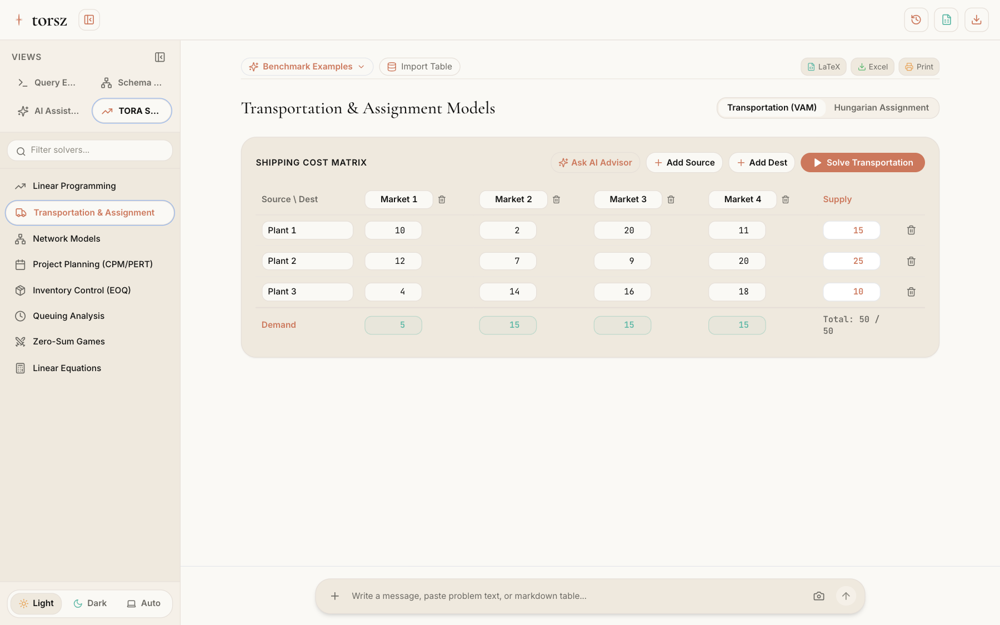
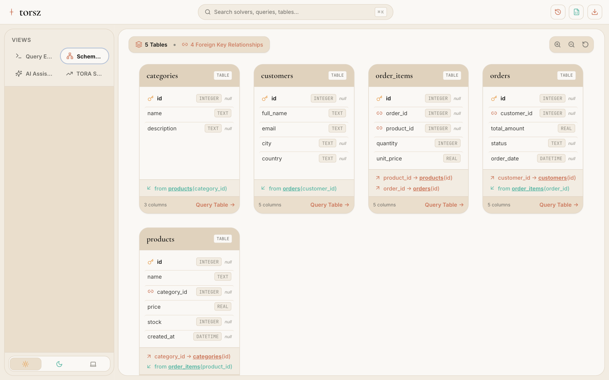
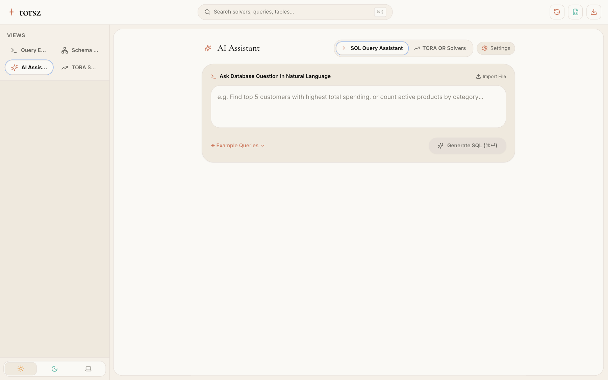

<div align="center">

# torsz

### A Warm-Editorial Web SQL IDE, Schema Visualizer & Operations Research Suite

[](https://github.com/sauravsz/torsz/actions/workflows/ci.yml)
[](https://torsz.vercel.app)
[](https://www.typescriptlang.org/)
[](https://react.dev/)
[](https://tailwindcss.com/)
[](https://webassembly.org/)
[](https://opensource.org/licenses/GPL-2.0)

**[🌐 Launch Live Web App on Vercel](https://torsz.vercel.app)**

<br/>

<a href="https://torsz.vercel.app">
  
</a>

</div>

---

## Overview

**torsz** is a fast, zero-install Web SQL IDE, spreadsheet data engine, database visualizer, and operations research solver built with a **warm-editorial design system**.

Powered by an in-browser **WebAssembly SQLite engine** (`sql.js`), **torsz** enables engineers, data analysts, researchers, and students to query data, visualize database schemas, and solve complex mathematical optimization models directly in the browser with zero server installation.

---

## Visual Tour

### 1. Monaco SQL Worksheet & In-Place Spreadsheet Data Grid
Write SQL in a customized Monaco editor with dark product syntax highlighting, and double-click any cell in the results table to edit values in-place with automatic `UPDATE` generation and staged save bar.

<div align="center">
  
</div>

<br/>

### 2. TORA Operations Research Suite (2D Graphical Solver & Simplex Tableaus)
Solve complex mathematical optimization problems with real-time editable matrices, interactive 2D graphical constraint canvases, step-by-step Simplex tableaus, Vogel's VAM transportation, and Hungarian assignment.

<div align="center">
  
</div>

<br/>

### 3. In-Browser OCR Paper Question Scanner & Classifier
Upload or paste photos of exam questions, cost matrices, or network graphs. The client-side OCR engine extracts text and parameters, classifies the problem type, and populates the solver in 1 click.

<div align="center">
  
</div>

<br/>

### 4. Interactive Schema Visualizer (ER Diagram)
Inspect table relationships, primary key constraints, and foreign key mappings on an interactive canvas with zoom controls.

<div align="center">
  
</div>

<br/>

### 5. AI Database & Optimization Assistant
Ask questions about your data or formulate optimization models in plain English. `torsz` translates your request into accurate SQL and mathematical formulations with 1-click execution and solver integration.

<div align="center">
  
</div>
---

## Core Capabilities

### 🗄️ Database & Spreadsheet Engineering
- **In-Browser WebAssembly SQLite**: Zero install, runs client-side with instant query execution and persistent IndexedDB storage.
- **1-Click Spreadsheet Ingestion**: Drag-and-drop or select `.csv`, `.tsv`, `.xlsx`, or `.xls` files to auto-create typed SQL tables.
- **In-Place Cell Editing**: Double-click any value in the data grid to edit like a spreadsheet, with staged change tracking and 1-click database commit.
- **Monaco SQL Worksheet**: Custom dark syntax theme, **`⌘ + Enter` / `Ctrl + Enter`** execution, and multi-cursor editing.
- **Interactive Schema Visualizer**: Live Entity-Relationship diagrams with foreign-key relation maps and quick table querying.
- **AI SQL Assistant**: Natural language to SQL translator powered by Groq, OpenRouter, Claude, or local semantic fallback.

### 📐 TORA Operations Research Suite
- **Linear Programming (Simplex & 2D Graphical Canvas)**: Interactive constraint line plotting, feasible polygon shading, extreme vertex evaluation, and step-by-step Simplex iteration tableaus with dual shadow prices.
- **Transportation & Assignment Models**: Vogel's Approximation Method (VAM) and the Hungarian Assignment Algorithm (Kuhn-Munkres).
- **Network Models**: Dijkstra Shortest Route, Kruskal/Prim Minimum Spanning Tree (MST), and Edmonds-Karp Maximal Flow.
- **Project Planning (CPM / PERT)**: Forward/Backward passes, Earliest & Latest start dates, Slack floats, Critical Path identification, and 3-Time PERT variance calculations.
- **Inventory Control (EOQ Models)**: Classic Economic Order Quantity ($y^* = \sqrt{2KD/h}$), cycle times, and planned backorder shortage models.
- **Queuing Analysis**: Steady-state operating characteristics for $M/M/1$ and $M/M/c$ multi-server queues ($\rho$, $L_q$, $L_s$, $W_q$, $W_s$).
- **Zero-Sum Games & Linear Systems**: Minimax/Maximin security levels, saddle points, and Gauss-Jordan elimination ($Ax = b$).

---

## Lineage & Foundations: The Multidisciplinary Evolution of torsz

**torsz** is a synthesis of foundational open-source toolkits, textbook software, and modern web architectures:

1. **[TOra (Toolkit for Oracle & Open SQL IDE)](https://github.com/tora-tool/tora)**:
   - *Heritage*: Created by Henrik Johnson, Petr Vaněk, Mike Johnson, Alexey Danilchenko, Ivan Březina, and open-source contributors over 20+ years as a C++/Qt database management workstation.
   - *Evolution*: `torsz` honors TOra's developer-first database heritage while modernizing it into a zero-install web application powered by WebAssembly, TypeScript, and a warm-editorial design system.

2. **[TORA Operations Research Software](https://www.pearson.com/)**:
   - *Heritage*: The classic educational optimization software package for linear programming, network routing, and decision science.
   - *Evolution*: Reconstructed as a modern, reactive TypeScript optimization suite with interactive SVG constraint graphing, step-by-step Simplex tableaus, and direct SQL export integration.

3. **[RouteIQ Network Optimization Engine](https://github.com/sauravsz/RouteIQ)**:
   - *Heritage*: Multi-scenario transportation network optimizer with linear programming, supply-demand balancing algorithms, and sensitivity analytics.
   - *Evolution*: Contributed mathematical formulation patterns, matrix balancing logic, and network graph solvers.

4. **[SZRoute AI Gateway Architecture](https://github.com/sauravsz/SZRoute)**:
   - *Heritage*: Multi-provider semantic model gateway and intelligent token compression engine.
   - *Evolution*: Provided the schema-aware prompt engineering, model fallback pipelines, and natural language translation capabilities in the AI SQL Assistant.

5. **[sql.js & SQLite WebAssembly](https://github.com/sql-js/sql.js)**:
   - *Heritage*: Official WebAssembly port of SQLite.
   - *Evolution*: Powers the zero-latency in-browser database engine and binary database export capabilities.

6. **[Monaco Editor](https://github.com/microsoft/monaco-editor)**:
   - *Heritage*: The core code editor that powers Visual Studio Code.
   - *Evolution*: Provides `torsz` with professional-grade SQL editing, auto-complete, keyboard shortcuts, and dark product syntax themes.

---

## Getting Started

### 1. Clone & Install Dependencies

```bash
git clone https://github.com/sauravsz/torsz.git
cd torsz

bun install
```

### 2. Run in Development Mode

```bash
bun run dev
```

Open [http://localhost:1420](http://localhost:1420) in your browser.

### 3. Build for Production

```bash
bun run build
```

---

## Keyboard Shortcuts

| Shortcut | Action |
|---|---|
| **`⌘ + Enter` / `Ctrl + Enter`** | Execute current SQL query |
| **`⌘ + B` / `Ctrl + B`** | Toggle database schema sidebar |
| **`Enter`** *(in cell)* | Stage in-place cell edit |
| **`Escape`** *(in cell)* | Cancel cell edit |
| **`⌥ + ⇧ + F`** | Format SQL statement |
| **`⌘ + /` / `Ctrl + /`** | Toggle SQL line comment (`--`) |
| **`⌘ + F` / `Ctrl + F`** | Search within editor |

---

## License

This project is licensed under the **GNU General Public License v2.0 (GPL-2.0)**, honoring the original TOra license.
